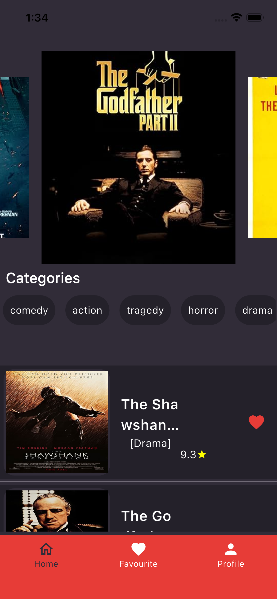
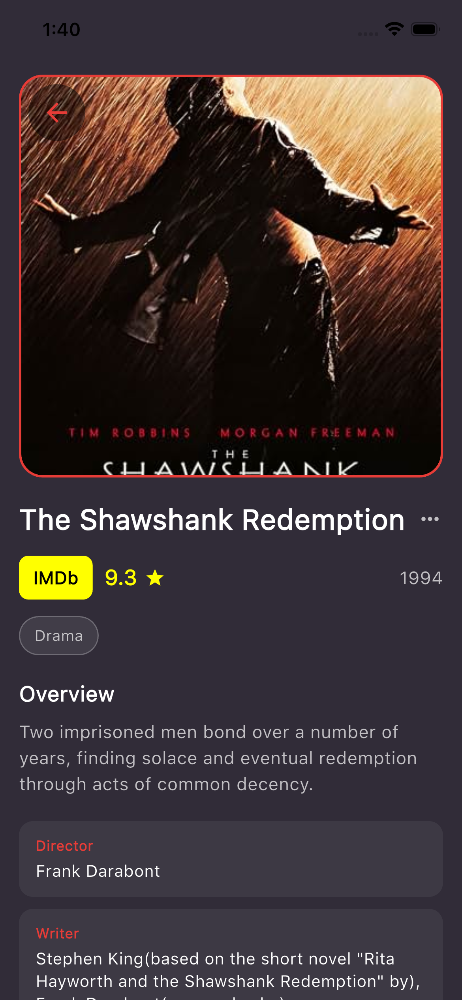
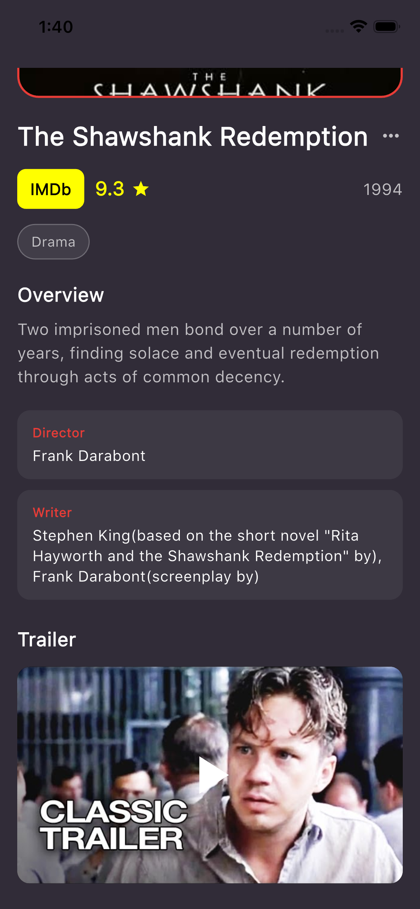
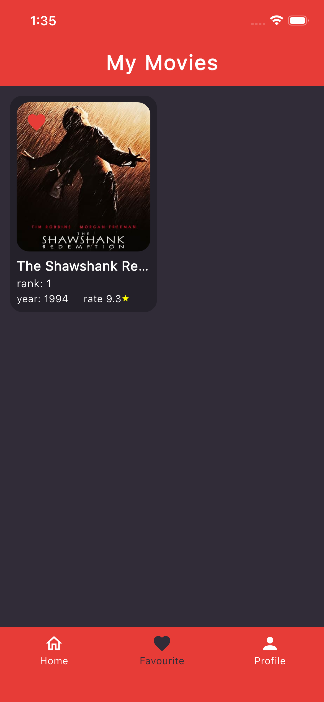
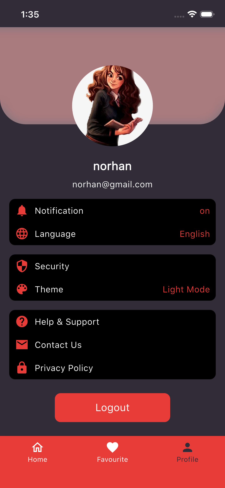

# Movie App

Flutter movie browsing app with local authentication, SQLite favorites, and IMDb Top 100 movies via RapidAPI.

**Initially created:** March 2023

## Screenshots

<p align="center">
  
  &nbsp;&nbsp;
  
  &nbsp;&nbsp;
  
</p>

<p align="center">
  
  &nbsp;&nbsp;
  
</p>

| Home | Details | Trailer | Favourites | Profile |
|:----:|:-------:|:-------:|:----------:|:-------:|
| Browse top movies & genres | Overview, cast & crew | YouTube trailer | Saved movies | Account & logout |

## Features

- Welcome / login / sign-up (local SQLite users)
- Home feed with carousel, genre filters, and movie list
- Movie details with YouTube trailer playback
- Favourites stored locally with SQLite
- Profile with session restore and logout

## Requirements

- Flutter 3.24+ (Dart 3.5+)
- A [RapidAPI](https://rapidapi.com/) key for **IMDb Top 100 Movies**

## Setup

```bash
flutter pub get
flutter run
```

Optional: override the API key:

```bash
flutter run --dart-define=RAPIDAPI_KEY=your_rapidapi_key_here
```

Build example:

```bash
flutter build apk
```

## Notes

- Passwords are stored as salted SHA-256 hashes (not plaintext).
- Existing local accounts created before this update must be re-registered after the DB schema upgrade.
- Social login buttons are UI placeholders only.
- A demo RapidAPI key is embedded for local `flutter run`; override it with `--dart-define` if needed.
